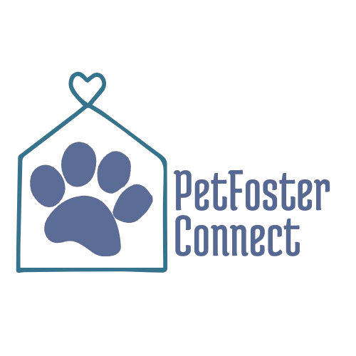

# 🐾 Pet Foster Connect 🐾

  
   
  Une plateforme pour connecter les familles d'accueil et les associations de protection animale.

## 🌟 Description

Pet Foster Connect est une application web conçue pour simplifier et accélérer le processus d'accueil temporaire d'animaux en difficulté.  Notre objectif est de mettre en relation les associations de protection animale, souvent débordées, avec des familles d'accueil volontaires et qualifiées, afin d'améliorer le bien-être des animaux en attente d'adoption et de soulager la charge de travail des associations.

## ✨ Fonctionnalités

*   **Inscription et authentification :** Pour les associations et les familles d'accueil.
*   **Profils détaillés :** Pour les animaux (avec photos, descriptions, besoins spécifiques) et les familles d'accueil (avec informations sur leur expérience et leurs préférences).
*   **Tableau de bord pour les associations :** Gestion des animaux, des demandes d'accueil et des profils des familles d'accueil.
*   **Gestion des candidatures :**  Suivi des candidatures des familles d'accueil et validation des demandes.

## 🚀 Technologies Utilisées

    *   Frontend : React
    *   Backend : Node.js
    *   Database : PostgreSQL

---

❤️ Merci de soutenir Pet Foster Connect ! Ensemble, améliorons la vie des animaux en attente d'un foyer.
